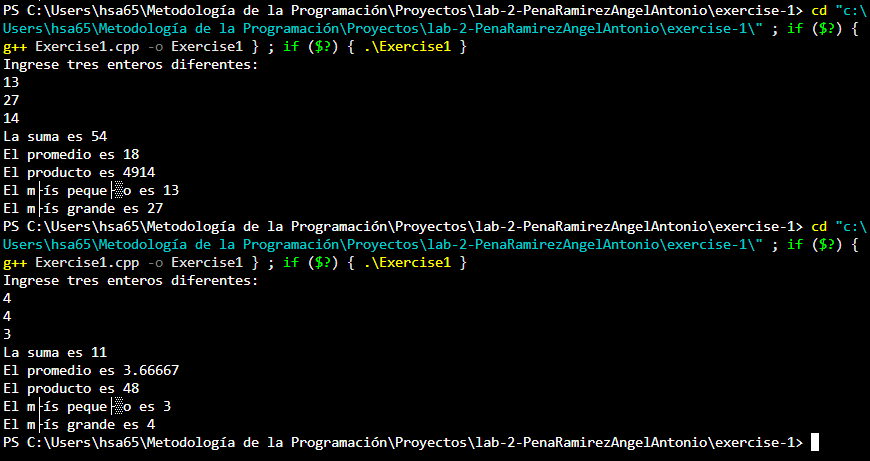

# Ejercicio de laboratorio 1: Suma, Promedio, Máximo y Mínimo

## Descripción

Escriba un programa que lea tres números enteros del teclado e imprima la suma, el promedio, el producto, el más pequeño y el más grande de estos números. El diálogo de la pantalla debería aparecer de la siguiente manera:

```cmd
Ingrese tres enteros diferentes: 13 27 14
La suma is 54
El promedio es 18
El producto es 4914
El más pequeño es 13
El más grande es 27
```

## Contesta las siguientes preguntas

1. Modifique su solución para usar tres declaraciones cin separadas en lugar de una. Escribe un mensaje separado para cada cin.

2. ¿Importa si se usa < o <= al hacer comparaciones para determinar el número entero más pequeño? ¿Cuál usaste y por qué?
R: Sí importa, ya que en una estamos diciendo que si a es menor que b, y en la otra estamos diciendo que si a es menor o igual que b, pueden dar distintos resultados. Yo usé la funcion "std::min", el cual retorna en una muestra de 2 valores el valor más pequeño, y sabiendo esto, utilicé 2 funciones min, una para retornar el valor mínimo de num1 o num2, y lo que retorne como mínimo, comparar cuál es el mínimo de ese resultado con num3 con otra función min, para finalmente dar el valor más pequeño de las 3 variables.

3. En el programa, probablemente usó una variable double o float para almacenar el promedio. Cambie el tipo de esa variable a entero. ¿El resultado es diferente de lo que observó anteriormente?
R: Sí, ya que elimina todo lo que queda después del punto decimal, no lo redondea. Por ejemplo, ingresé los números 4, 4 y 3, y su promedio debería de dar 3.66666..., pero al ser la variable "int", da como resultado 3.

## ✅ Resultado

