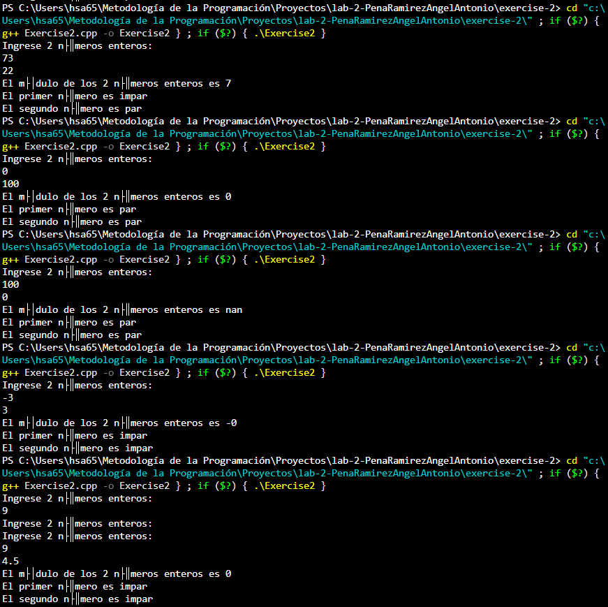
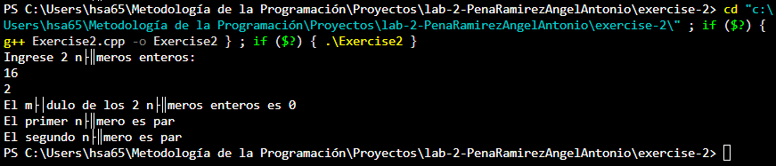

# Ejercicio de laboratorio 2 – Múltiplos

## Descripción

Escriba un programa que lea en dos números enteros y determine e imprima si el primero es un múltiplo del segundo. [Sugerencia: use el operador de módulo.]

```cmd
Ingrese dos enteros: 22 8
22 no es un múltiplo de 8
```

## Contesta las siguientes preguntas

1. ¿Se puede utilizar el operador de módulo con operandos no enteros? ¿Se puede usar con números negativos? Supongamos que el usuario ha introducido los siguientes conjuntos de números. Para cada serie, ¿qué produce en la tercera columna? Si hay un error, explique por qué.
R: Se puede usar el operador de módulo con números no enteros, pero el resultado no sería exacto, o sería incorrecto, y para solucionarlo se usa la función "fmod" de la librería cmath y asignar num1 y num2 como float, ya que si se usa solamente un "%" con números declarados como float, el programa lanza un error. Se puede usar el módulo con números negativos, C++ no tiene problema en ello.

   | Entero 1 | Entero 2 | Expresión        | Salida |
   | -------- | -------- | ---------------- | ------ |
   | 73       | 22       | cout << 73 % 22; |    7   |
   | 0        | 100      | cout << 0 % 100; |    0   |
   | 100      | 0        | cout << 100 % 0; |   nan  |
   | -3       | 3        | cout << -3 % 3;  |   -0   |
   | 9        | 4.5      | cout << 9 % 4.5; |    0   |
   | 16       | 2        | cout << 16 % 2;  |    0   |
NOTA: Las salidas anotadas se han hecho con números declarados como float y usando la función fmod de la librería cmath.

Se observa que fmod(100, 0) da como resultado "nan" (Not A Number) porque estamos realizando una división entre 0, lo cual no es posible en las matemáticas, da indefinido, por ende, no obtenemos módulo (o residuo).

2. ¿Qué pasa si colocamos un punto y coma (;) después del final de la expresión de condición de una declaración if?
R: Da error, si colocamos "if (condición); {código;}", el programa dice que espera una declaración, es decir, lo que va entre las llaves {}.

3. Modifique el programa para determinar si un número ingresado es par o impar. [Nota: Ahora, el usuario necesita ingresar solo un número.]

## ✅ Resultado



