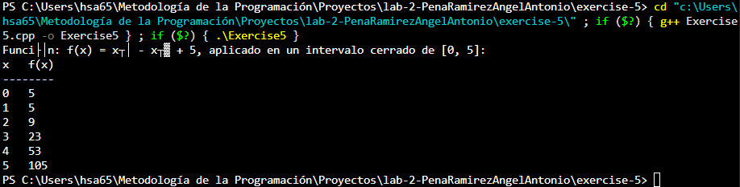

# Ejercicio de laboratorio 5 - f(x)

## Descripción

Escriba un programa de C++ que calcule f(x) = x³ - x² + 5 para x = {0, 1, 2, 3, 4, 5} de la siguiente manera:

```cmd
***********
x  f(x)
***********
0  5
1  5
2  9
3  23
4  53
5  105
***********
```
## ✅ Resultado

